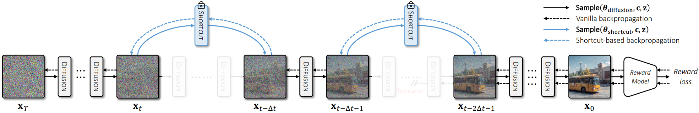

## ShortFT: Diffusion Model Alignment via Shortcut-based Fine-Tuning<br><sub>Official PyTorch code release for the ICCV 2025 paper: https://arxiv.org</sub>



**ShortFT: Diffusion Model Alignment via Shortcut-based Fine-Tuning**<br>
Xiefan Guo, Miaomiao Cui, Liefeng Bo, Di Huang<br>
https://xiefan-guo.github.io/shortft<br>

Abstract: *Backpropagation-based approaches aim to align diffusion models with reward functions through end-to-end backpropagation of the reward gradient within the denoising chain, offering a promising perspective. However, due to the computational costs and the risk of gradient explosion associated with the lengthy denoising chain, existing approaches struggle to achieve complete gradient backpropagation, leading to suboptimal results. In this paper, we introduce Shortcut-based Fine-Tuning (ShortFT), an efficient fine-tuning strategy that utilizes the shorter denoising chain. More specifically, we employ the recently researched trajectory-preserving few-step diffusion model, which enables a shortcut over the original denoising chain, and construct a shortcut-based denoising chain of shorter length. The optimization on this chain notably enhances the efficiency and effectiveness of fine-tuning the foundational model. Our method has been rigorously tested and can be effectively applied to various reward functions, significantly improving alignment performance and surpassing state-of-the-art alternatives.*


The code will be updated by the end of August.


## Citation

```bibtex
@inproceedings{guo2025shortft,
    title     = {ShortFT: Diffusion Model Alignment via Shortcut-based Fine-Tuning},
    author    = {Guo, Xiefan and Cui, Miaomiao and Bo, Liefeng and Huang, Di},
    booktitle = {ICCV},
    year      = {2025}
}
```

